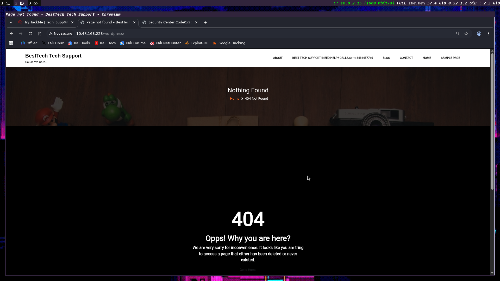
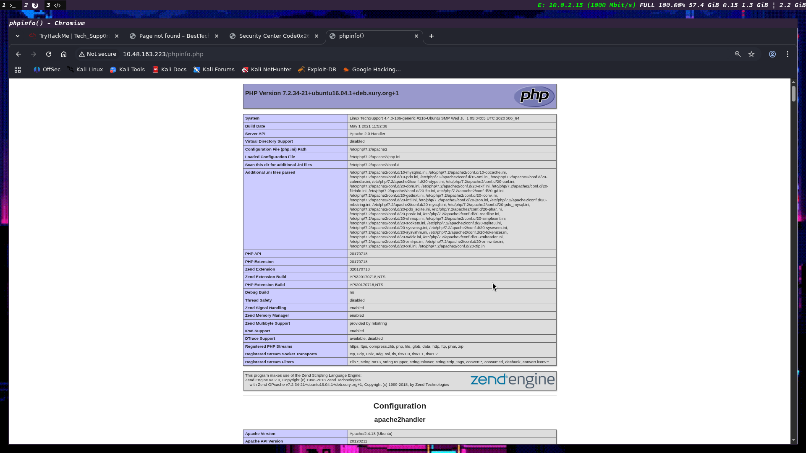
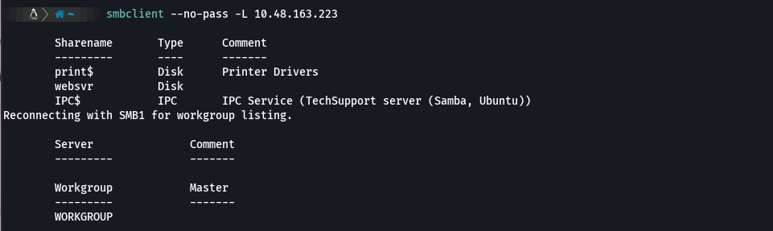
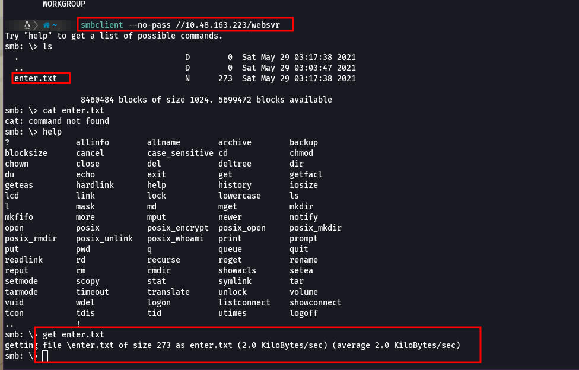

# Tech_Supp0rt: 1

## Nmap Scan

```
┌──(kali㉿kali)-[~]
└─$ sudo nmap -A -sV -O 10.48.148.95
Starting Nmap 7.98 ( https://nmap.org ) at 2026-05-18 22:22 -0400
Nmap scan report for 10.48.148.95
Host is up (0.021s latency).
Not shown: 996 closed tcp ports (reset)
PORT    STATE SERVICE     VERSION
22/tcp  open  ssh         OpenSSH 7.2p2 Ubuntu 4ubuntu2.10 (Ubuntu Linux; protocol 2.0)
| ssh-hostkey: 
|   2048 10:8a:f5:72:d7:f9:7e:14:a5:c5:4f:9e:97:8b:3d:58 (RSA)
|   256 7f:10:f5:57:41:3c:71:db:b5:5b:db:75:c9:76:30:5c (ECDSA)
|_  256 6b:4c:23:50:6f:36:00:7c:a6:7c:11:73:c1:a8:60:0c (ED25519)
80/tcp  open  http        Apache httpd 2.4.18 ((Ubuntu))
|_http-server-header: Apache/2.4.18 (Ubuntu)
|_http-title: Apache2 Ubuntu Default Page: It works
139/tcp open  netbios-ssn Samba smbd 3.X - 4.X (workgroup: WORKGROUP)
445/tcp open  netbios-ssn Samba smbd 4.3.11-Ubuntu (workgroup: WORKGROUP)
No exact OS matches for host (If you know what OS is running on it, see https://nmap.org/submit/ ).
TCP/IP fingerprint:
OS:SCAN(V=7.98%E=4%D=5/18%OT=22%CT=1%CU=33774%PV=Y%DS=3%DC=T%G=Y%TM=6A0BC96
OS:E%P=x86_64-pc-linux-gnu)SEQ(SP=100%GCD=1%ISR=10A%TI=Z%CI=I%II=I%TS=8)SEQ
OS:(SP=102%GCD=1%ISR=108%TI=Z%CI=I%II=I%TS=8)SEQ(SP=102%GCD=1%ISR=10D%TI=Z%
OS:CI=I%II=I%TS=8)SEQ(SP=105%GCD=1%ISR=10C%TI=Z%CI=I%II=I%TS=8)SEQ(SP=107%G
OS:CD=1%ISR=10B%TI=Z%CI=I%II=I%TS=8)OPS(O1=M4E8ST11NW7%O2=M4E8ST11NW7%O3=M4
OS:E8NNT11NW7%O4=M4E8ST11NW7%O5=M4E8ST11NW7%O6=M4E8ST11)WIN(W1=68DF%W2=68DF
OS:%W3=68DF%W4=68DF%W5=68DF%W6=68DF)ECN(R=Y%DF=Y%T=40%W=6903%O=M4E8NNSNW7%C
OS:C=Y%Q=)T1(R=Y%DF=Y%T=40%S=O%A=S+%F=AS%RD=0%Q=)T2(R=N)T3(R=N)T4(R=Y%DF=Y%
OS:T=40%W=0%S=A%A=Z%F=R%O=%RD=0%Q=)T5(R=Y%DF=Y%T=40%W=0%S=Z%A=S+%F=AR%O=%RD
OS:=0%Q=)T6(R=Y%DF=Y%T=40%W=0%S=A%A=Z%F=R%O=%RD=0%Q=)T7(R=Y%DF=Y%T=40%W=0%S
OS:=Z%A=S+%F=AR%O=%RD=0%Q=)U1(R=Y%DF=N%T=40%IPL=164%UN=0%RIPL=G%RID=G%RIPCK
OS:=G%RUCK=G%RUD=G)IE(R=Y%DFI=N%T=40%CD=S)

Network Distance: 3 hops
Service Info: Host: TECHSUPPORT; OS: Linux; CPE: cpe:/o:linux:linux_kernel

Host script results:
| smb2-time: 
|   date: 2026-05-19T02:22:34
|_  start_date: N/A
| smb2-security-mode: 
|   3.1.1: 
|_    Message signing enabled but not required
| smb-security-mode: 
|   account_used: guest
|   authentication_level: user
|   challenge_response: supported
|_  message_signing: disabled (dangerous, but default)
|_clock-skew: mean: -1h49m59s, deviation: 3h10m31s, median: 0s
| smb-os-discovery: 
|   OS: Windows 6.1 (Samba 4.3.11-Ubuntu)
|   Computer name: techsupport
|   NetBIOS computer name: TECHSUPPORT\x00
|   Domain name: \x00
|   FQDN: techsupport
|_  System time: 2026-05-19T07:52:33+05:30

TRACEROUTE (using port 993/tcp)
HOP RTT      ADDRESS
1   19.86 ms 192.168.128.1
2   ...
3   20.18 ms 10.48.148.95

OS and Service detection performed. Please report any incorrect results at https://nmap.org/submit/ .
Nmap done: 1 IP address (1 host up) scanned in 34.03 seconds

```

- We can see that **ssh-22, http-80 and SMB -139,445** ports are open.
- We can do **Web enumeration and SMB enumeration**

The Web has hit me with a Ubuntu Apache default page 


Now it is better to do some **directory enumeration ,** for now I am going with the common files found in the website

## Web directory enumeration

```
gobuster dir -u http://10.48.163.223  -w /usr/share/wordlists/dirb/common.txt              
```

### Output

```
===============================================================
Gobuster v3.8.2
by OJ Reeves (@TheColonial) & Christian Mehlmauer (@firefart)
===============================================================
[+] Url:                     http://10.48.163.223
[+] Method:                  GET
[+] Threads:                 10
[+] Wordlist:                /usr/share/wordlists/dirb/common.txt
[+] Negative Status codes:   404
[+] User Agent:              gobuster/3.8.2
[+] Timeout:                 10s
===============================================================
Starting gobuster in directory enumeration mode
===============================================================
.htaccess            (Status: 403) [Size: 278]
.htpasswd            (Status: 403) [Size: 278]
.hta                 (Status: 403) [Size: 278]
index.html           (Status: 200) [Size: 11321]
phpinfo.php          (Status: 200) [Size: 94949]
server-status        (Status: 403) [Size: 278]
test                 (Status: 301) [Size: 313] [--> http://10.48.163.223/test/]
wordpress            (Status: 301) [Size: 318] [--> http://10.48.163.223/wordpress/]
Progress: 4613 / 4613 (100.00%)
===============================================================
Finished
===============================================================
```

Here there seems to be some interesting stuff

We can observe that they are using **word press** and some **test**  these seem to juicy stuff 

WordPress 



Test 


The Test directory may be used for phishing or scam bating the people. 

Phpinfo



I think may be the inital access for this machine would be enumerating the SMB share or PHP or  some vulnerable wordpress plugins. 

Now let’s do some recon **SMB** share

## SMB enumeration

```bash
enum4linux -a 10.48.163.223
```

### Output

```
enum4linux -a 10.48.163.223                                                                                                                                                            ░▒▓ INT ✘  at 12:21:28 PM  ▓▒░
Starting enum4linux v0.9.1 ( http://labs.portcullis.co.uk/application/enum4linux/ ) on Tue May 19 12:30:24 2026

 =========================================( Target Information )=========================================

Target ........... 10.48.163.223
RID Range ........ 500-550,1000-1050
Username ......... ''
Password ......... ''
Known Usernames .. administrator, guest, krbtgt, domain admins, root, bin, none

 ===========================( Enumerating Workgroup/Domain on 10.48.163.223 )===========================

[E] Can't find workgroup/domain

 ===============================( Nbtstat Information for 10.48.163.223 )===============================

Looking up status of 10.48.163.223
No reply from 10.48.163.223

 ===================================( Session Check on 10.48.163.223 )===================================

[+] Server 10.48.163.223 allows sessions using username '', password ''

 ================================( Getting domain SID for 10.48.163.223 )================================

Domain Name: WORKGROUP
Domain Sid: (NULL SID)

[+] Can't determine if host is part of domain or part of a workgroup

 ==================================( OS information on 10.48.163.223 )==================================

[E] Can't get OS info with smbclient

[+] Got OS info for 10.48.163.223 from srvinfo: 
    TECHSUPPORT    Wk Sv PrQ Unx NT SNT TechSupport server (Samba, Ubuntu)
    platform_id     :	500
    os version      :	6.1
    server type     :	0x809a03

 =======================================( Users on 10.48.163.223 )=======================================

Use of uninitialized value $users in print at ./enum4linux.pl line 972.
Use of uninitialized value $users in pattern match (m//) at ./enum4linux.pl line 975.

Use of uninitialized value $users in print at ./enum4linux.pl line 986.
Use of uninitialized value $users in pattern match (m//) at ./enum4linux.pl line 988.

 =================================( Share Enumeration on 10.48.163.223 )=================================

    Sharename       Type      Comment
    ---------       ----      -------
    print$          Disk      Printer Drivers
    websvr          Disk      
    IPC$            IPC       IPC Service (TechSupport server (Samba, Ubuntu))
Reconnecting with SMB1 for workgroup listing.

    Server               Comment
    ---------            -------

    Workgroup            Master
    ---------            -------
    WORKGROUP            

[+] Attempting to map shares on 10.48.163.223

//10.48.163.223/print$	Mapping: DENIED Listing: N/A Writing: N/A
//10.48.163.223/websvr	Mapping: OK Listing: OK Writing: N/A

[E] Can't understand response:

NT_STATUS_OBJECT_NAME_NOT_FOUND listing \*
//10.48.163.223/IPC$	Mapping: N/A Listing: N/A Writing: N/A

 ===========================( Password Policy Information for 10.48.163.223 )===========================

Password: 

[+] Attaching to 10.48.163.223 using a NULL share

[+] Trying protocol 139/SMB...

[+] Found domain(s):

    [+] TECHSUPPORT
    [+] Builtin

[+] Password Info for Domain: TECHSUPPORT

    [+] Minimum password length: 5
    [+] Password history length: None
    [+] Maximum password age: 136 years 37 days 6 hours 21 minutes 
    [+] Password Complexity Flags: 000000

        [+] Domain Refuse Password Change: 0
        [+] Domain Password Store Cleartext: 0
        [+] Domain Password Lockout Admins: 0
        [+] Domain Password No Clear Change: 0
        [+] Domain Password No Anon Change: 0
        [+] Domain Password Complex: 0

    [+] Minimum password age: None
    [+] Reset Account Lockout Counter: 30 minutes 
    [+] Locked Account Duration: 30 minutes 
    [+] Account Lockout Threshold: None
    [+] Forced Log off Time: 136 years 37 days 6 hours 21 minutes 

[+] Retieved partial password policy with rpcclient:

Password Complexity: Disabled
Minimum Password Length: 5

 ======================================( Groups on 10.48.163.223 )======================================

[+] Getting builtin groups:

[+]  Getting builtin group memberships:

[+]  Getting local groups:

[+]  Getting local group memberships:

[+]  Getting domain groups:

[+]  Getting domain group memberships:

 ==================( Users on 10.48.163.223 via RID cycling (RIDS: 500-550,1000-1050) )==================

[I] Found new SID: 
S-1-22-1

[I] Found new SID: 
S-1-5-32

[I] Found new SID: 
S-1-5-32

[I] Found new SID: 
S-1-5-32

[I] Found new SID: 
S-1-5-32

[+] Enumerating users using SID S-1-5-21-2071169391-1069193170-3284189824 and logon username '', password ''

S-1-5-21-2071169391-1069193170-3284189824-501 TECHSUPPORT\nobody (Local User)
S-1-5-21-2071169391-1069193170-3284189824-513 TECHSUPPORT\None (Domain Group)

[+] Enumerating users using SID S-1-5-32 and logon username '', password ''

S-1-5-32-544 BUILTIN\Administrators (Local Group)
S-1-5-32-545 BUILTIN\Users (Local Group)
S-1-5-32-546 BUILTIN\Guests (Local Group)
S-1-5-32-547 BUILTIN\Power Users (Local Group)
S-1-5-32-548 BUILTIN\Account Operators (Local Group)
S-1-5-32-549 BUILTIN\Server Operators (Local Group)
S-1-5-32-550 BUILTIN\Print Operators (Local Group)

[+] Enumerating users using SID S-1-22-1 and logon username '', password ''

S-1-22-1-1000 Unix User\scamsite (Local User)

 ===============================( Getting printer info for 10.48.163.223 )===============================

No printers returned.

enum4linux complete on Tue May 19 12:33:10 2026

```

The above shares were interesting so I tried to check for no password login using SMB yeah it was successful





got some good information about some initial access for the machine - need to check what does it make some sense or not 

I think these might be the creds for login wordpress admin login page

Now I think it is better to some recon on the wordpress website


Recon on Wordpress directory 

```bash
gobuster dir -u http://10.48.163.223/wordpress/  -w /usr/share/wordlists/dirb/common.txt                                                                                                   ░▒▓ ✔  at 01:26:49 PM  ▓▒░
===============================================================
Gobuster v3.8.2
by OJ Reeves (@TheColonial) & Christian Mehlmauer (@firefart)
===============================================================
[+] Url:                     http://10.48.163.223/wordpress/
[+] Method:                  GET
[+] Threads:                 10
[+] Wordlist:                /usr/share/wordlists/dirb/common.txt
[+] Negative Status codes:   404
[+] User Agent:              gobuster/3.8.2
[+] Timeout:                 10s
===============================================================
Starting gobuster in directory enumeration mode
===============================================================
.hta                 (Status: 403) [Size: 278]
.htaccess            (Status: 403) [Size: 278]
.htpasswd            (Status: 403) [Size: 278]
index.php            (Status: 200) [Size: 33441]
wp-admin             (Status: 301) [Size: 327] [--> http://10.48.163.223/wordpress/wp-admin/]
wp-content           (Status: 301) [Size: 329] [--> http://10.48.163.223/wordpress/wp-content/]
wp-includes          (Status: 301) [Size: 330] [--> http://10.48.163.223/wordpress/wp-includes/]
xmlrpc.php           (Status: 405) [Size: 42]
Progress: 4613 / 4613 (100.00%)
===============================================================
Finished
===============================================================

```

This seems to be intersting 


now let’s try that creds and get some access to the admin page 

first we need crack the creds 

### Creds

```bash
GOALS
=====
1)Make fake popup and host it online on Digital Ocean server
2)Fix subrion site, /subrion doesn't work, edit from panel
3)Edit wordpress website

IMP
===
Subrion creds
|->admin:7sKvntXdPEJaxazce9PXi24zaFrLiKWCk [cooked with magical formula]
Wordpress creds
|->

decrypted password encryption was base64 encoded 
admin:Scam2021
```

This seems to be weird, the directory is getting redirected to some different IP , need to check what is the issue.


Actually the hints were in the enter.txt file 

finally got into some dashboard 


I think the version of this is vulnerable let’s do some recon on this 

There was a public exploit available now let’s gonna test it against the application 


finally got a inital access


Now let’s just stabilize the shell in order to get more control over it +


### wp-config.php output

```bash
cat ../../wordpress/wp-config.php
<?php
/**
 * The base configuration for WordPress
 *
 * The wp-config.php creation script uses this file during the
 * installation. You don't have to use the web site, you can
 * copy this file to "wp-config.php" and fill in the values.
 *
 * This file contains the following configurations:
 *
 * * MySQL settings
 * * Secret keys
 * * Database table prefix
 * * ABSPATH
 *
 * @link https://wordpress.org/support/article/editing-wp-config-php/
 *
 * @package WordPress
 */

// ** MySQL settings - You can get this info from your web host ** //
/** The name of the database for WordPress */
define( 'DB_NAME', 'wpdb' );

/** MySQL database username */
define( 'DB_USER', 'support' );

/** MySQL database password */
define( 'DB_PASSWORD', '**ImAScammerLOL!123!**' );

/** MySQL hostname */
define( 'DB_HOST', 'localhost' );

/** Database Charset to use in creating database tables. */
define( 'DB_CHARSET', 'utf8' );

/** The Database Collate type. Don't change this if in doubt. */
define( 'DB_COLLATE', '' );

/**#@+
 * Authentication Unique Keys and Salts.
 *
 * Change these to different unique phrases!
 * You can generate these using the {@link https://api.wordpress.org/secret-key/1.1/salt/ WordPress.org secret-key service}
 * You can change these at any point in time to invalidate all existing cookies. This will force all users to have to log in again.
 *
 * @since 2.6.0
 */
define( 'AUTH_KEY',         'put your unique phrase here' );
define( 'SECURE_AUTH_KEY',  'put your unique phrase here' );
define( 'LOGGED_IN_KEY',    'put your unique phrase here' );
define( 'NONCE_KEY',        'put your unique phrase here' );
define( 'AUTH_SALT',        'put your unique phrase here' );
define( 'SECURE_AUTH_SALT', 'put your unique phrase here' );
define( 'LOGGED_IN_SALT',   'put your unique phrase here' );
define( 'NONCE_SALT',       'put your unique phrase here' );

/**#@-*/

/**
 * WordPress Database Table prefix.
 *
 * You can have multiple installations in one database if you give each
 * a unique prefix. Only numbers, letters, and underscores please!
 */
$table_prefix = 'wp_';

/**
 * For developers: WordPress debugging mode.
 *
 * Change this to true to enable the display of notices during development.
 * It is strongly recommended that plugin and theme developers use WP_DEBUG
 * in their development environments.
 *
 * For information on other constants that can be used for debugging,
 * visit the documentation.
 *
 * @link https://wordpress.org/support/article/debugging-in-wordpress/
 */
define( 'WP_DEBUG', false );

/* That's all, stop editing! Happy publishing. */

/** Absolute path to the WordPress directory. */
if ( ! defined( 'ABSPATH' ) ) {
    define( 'ABSPATH', __DIR__ . '/wordpress/' );
}

define('WP_HOME', '/wordpress/index.php');
define('WP_SITEURL', '/wordpress/');

/** Sets up WordPress vars and included files. */
require_once ABSPATH . 'wp-settings.php';

$ 

```

this might the ssh password 

```bash
**ImAScammerLOL!123!**
```

### Finally got the ssh access


Now let’s try to gain root access

This seems to be interesting 


let’s go and check in gtfo bins 

finally got the root flag 


### root.txt

```bash
851b8233a8c09400ec30651bd1529bf1ed02790b
```