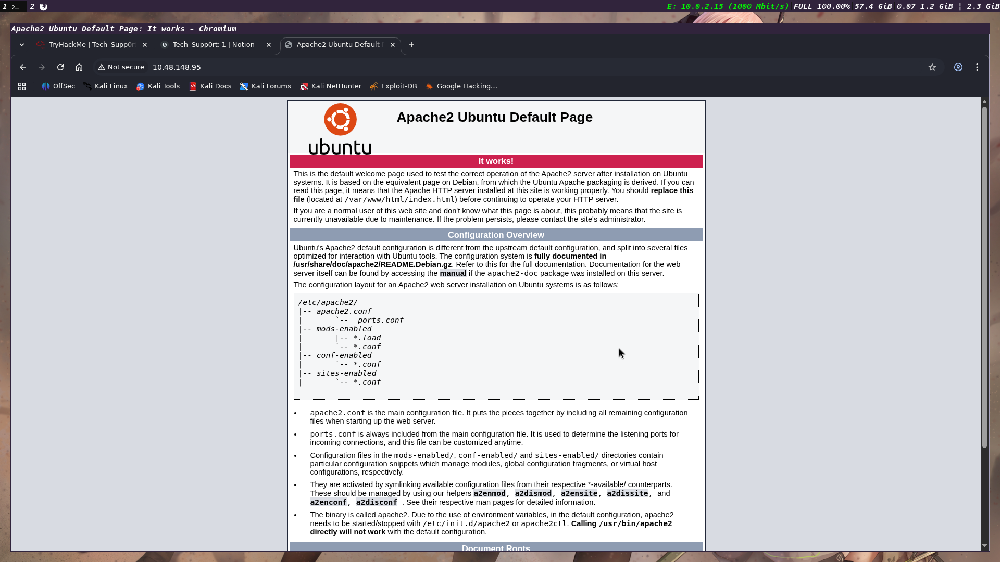
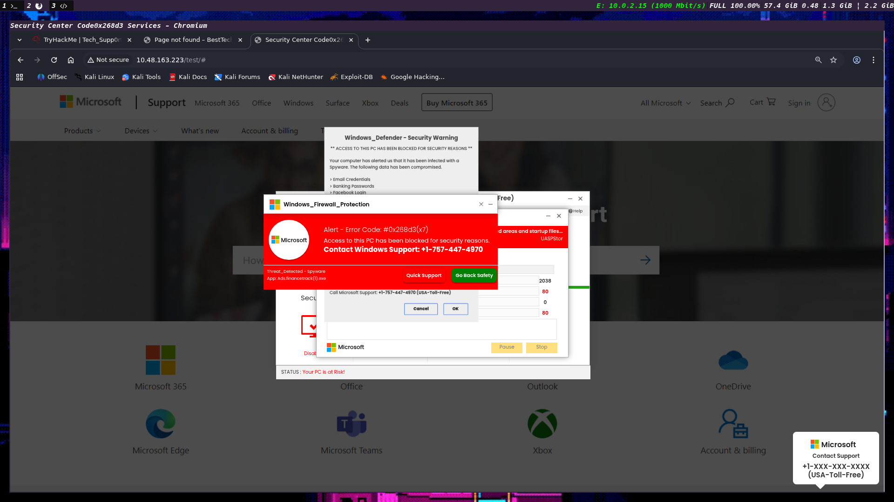

# Tech_Supp0rt: 1

## Nmap Scan

I started with a full `nmap` scan to identify open services and versions.

```bash
sudo nmap -A -sV -O 10.48.148.95
```

The scan showed these open ports:
- `22/tcp` SSH running OpenSSH 7.2p2 on Ubuntu
- `80/tcp` HTTP running Apache 2.4.18 on Ubuntu
- `139/tcp` and `445/tcp` SMB via Samba

The web service returned the default Apache Ubuntu page, which means the site is accessible but not yet customized.

The target also exposed SMB-related information, including `smb2-time`, `smb2-security-mode`, and `smb-os-discovery`, with the host reporting as `TECHSUPPORT` on Samba.

The initial attack surface is therefore:
- web application enumeration
- SMB share enumeration
- SSH, if credentials can be discovered later



## Web Directory Enumeration

I used `gobuster` against the web server to discover hidden directories and endpoints.

```bash
gobuster dir -u http://10.48.163.223 -w /usr/share/wordlists/dirb/common.txt
```

### Results

- `.htaccess` — 403
- `.htpasswd` — 403
- `.hta` — 403
- `index.html` — 200
- `phpinfo.php` — 200
- `server-status` — 403
- `test` — 301 redirect
- `wordpress` — 301 redirect

This revealed an exposed `phpinfo.php` page and a WordPress installation, both of which are useful for further enumeration.

The `test` and `wordpress` directories look particularly promising for initial access.




The `phpinfo.php` page confirms the server is running PHP and gives additional server details.


At this stage, the likely attack paths are:
- vulnerable WordPress or WordPress plugins
- SMB share enumeration and access
- PHP misconfigurations or exposed information

## SMB Enumeration

Next I enumerated SMB with `enum4linux`.

```bash
enum4linux -a 10.48.163.223
```

### Findings

- The server allows anonymous SMB connections.
- Workgroup: `WORKGROUP`
- Server identifies as `TECHSUPPORT` running Samba on Ubuntu.
- SMB shares discovered:
  - `print$` — denied
  - `websvr` — accessible for listing
  - `IPC$` — unavailable

The SMB listing was useful because it confirmed access to an unauthenticated share and exposed some interesting metadata.

The target also reported that password complexity is disabled and the minimum password length is 5.

The user enumeration output included:
- `TECHSUPPORT\nobody` (local user)
- `Unix User\scamsite` (local user)
- common built-in groups like `Administrators`, `Users`, `Guests`, and `Print Operators`


This suggests the SMB service can be used to gather credentials or accessible files that may lead to initial access.

## WordPress Reconnaissance

I moved on to WordPress enumeration to identify the installed directories and possible login endpoints.

```bash
gobuster dir -u http://10.48.163.223/wordpress/ -w /usr/share/wordlists/dirb/common.txt
```

### Findings

- `index.php` — 200
- `wp-admin` — 301 redirect
- `wp-content` — 301 redirect
- `wp-includes` — 301 redirect
- `xmlrpc.php` — 405

This confirmed an active WordPress installation with the expected admin panel available.


## Credential Discovery

I found credential hints in the site content and nearby files. The notes indicated:

- Subrion credentials: `admin:7sKvntXdPEJaxazce9PXi24zaFrLiKWCk`
- WordPress credentials: `admin:Scam2021`

The WordPress password appears to have been recovered after decoding a base64-encoded value.

The site also included a redirect issue and a file named `enter.txt` containing useful hints.


Eventually I gained access to the WordPress dashboard.


## Exploitation

The WordPress instance appears to be running a vulnerable version, so I tested a public exploit against it.


The exploit succeeded and provided initial shell access.


## Stabilizing the Shell

After getting initial access, I stabilized the shell to improve control over the target environment.


## wp-config.php Review

I extracted database credentials from the WordPress configuration file.

```bash
cat ../../wordpress/wp-config.php
```

### Relevant configuration values

- `DB_NAME`: `wpdb`
- `DB_USER`: `support`
- `DB_PASSWORD`: `**ImAScammerLOL!123!**`
- `DB_HOST`: `localhost`

The configuration also confirms the WordPress install path and site URL settings.

```php
define('WP_HOME', '/wordpress/index.php');
define('WP_SITEURL', '/wordpress/');
```
